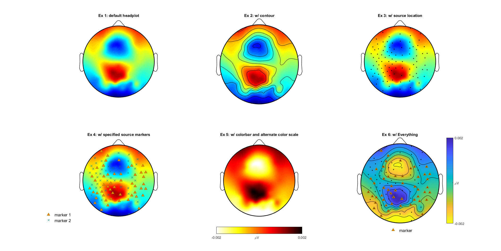

# ScalpPlot

#### ScalpPlot is a easy-to-use/customizable plot tool for drawing scalp maps of EEG/MEG data in MATLAB. 

<p>
    
</p>

### Features
- Consistent positioning and sizing (no gaps/extra space/constant sizing).
- Easy to customize labels, colors, etc.
- Draggable and resizable via MATLAB's plot GUI Tool.
- Lightweight.

### Motivation
ScalpPlot has been deconstructed from the popular topoplot.m from EEGLab by Schwartz Lab at UCSD. 
The original code has been cleaned up and refactored for readability and organization. ScalpPlot aims to be user friendly, easy-to-use
plot tool for both researchers and developers. All unnecessary depedenecis have been removed from the original topoplot.m for easy transportability.

# Getting Started
### Installation
- Linux/Windows/Mac
- MATLAB

1) On any Operating System's command prompt.
```
>> git clone https://github.com/JasonJKi/ScalpPlot.git
>> cd ScalpPlot
```
or download 
from the link in Green (Clone or Download).

2) In matlab command window.
```
>> cd ScalpPlot
>> setup install save # save argument will permanently add ScalPlot dir and it's subdirectories to path.
```

### Usage

#### From demo.m

Instantiate the ScalpPlot object once for all ScalpPlots by assigning a location file.
ScalpPlot is able to read all major EEG/MEG file extensions (.BDF, .LOC, .EGi, etc.)
```
scalpPlot = ScalpPlot(locationFilePath);
scalpPlot.setMap();
```

Set plot handle for easy control/customizability
```
plotHandle1 = subplot(2,3,1)
plotHandle2 = subplot(2,3,2)
plotHandle3 = subplot(2,3,3)
.
.
.
plotHandle3 = subplot(2,3,6)

```


#### Ex 1. Draw the default scalpPlot in the first subplot as above.
```
scalpPlot.setPlotHandle(plotHandle1); % Set plot handle and plot axes
scalpPlot.draw(A); % Draw headplot. A - Some scalp recording data/ forward model/ weights/ dipoles/ etc.
title('Ex 1: default headplot')
```
#### Ex 2. Head plot with contours.
```
scalpPlot.setPlotHandle(plotHandle2); % Set plot handle and plot axes
scalpPlot.draw(A);
scalpPlot.drawHeadContour();
title('Ex 2: w/ contour')
```
#### Ex 3. Head plot with value of source points.
```
scalpPlot.setPlotHandle(plotHandle3); % Set plot handle and plot axes
scalpPlot.draw(A);
scalpPlot.drawSourcePoints();
title('Ex 3: w/ source location')
```
#### Ex 4. Scalp plot with specified values on selective source points.
```
scalpPlot.setPlotHandle(plotHandle4); % Set plot handle and plot axes
scalpPlot.draw(A);
```
```
symbolStr = '^'; %'*', 'o', '.', 'x'
```
Any Matlab's markers can be chosen from this list: https://www.mathworks.com/help/matlab/ref/linespec.html
```
sourceIndex = (rand(1,96) > .5);
markerHandle1 = scalpPlot.drawOnElectrode(sourceIndex, symbolStr, [.5 .5 0],[1 .5 0]); % plot on siginficnt points
markerHandle2 = scalpPlot.drawOnElectrode(~sourceIndex, symbolStr, [0 .5 .5], [0 .5 1]); % plot on siginficnt points
handles = [markerHandle1 markerHandle2];
scalpPlot.drawMarkerLegend(handles, {'marker 1', 'marker 2'} ,'southwestoutside');
title('Ex 4: w/ specified source markers')
```
#### Ex 5. Head plot with specified colormap and axis.
```
scalpPlot.setPlotHandle(plotHandle5); % Set plot handle and plot axes
scalpPlot.draw(A);
```

```
colorMapVal = flipud(hot); % Assign colormap scale
```
Any one of Matlab's custom color maps can be chosen from this list: https://www.mathworks.com/help/matlab/ref/colormap.html#buc3wsn-1-map
```
maxVal = max(A); minVal = min(A); % Set color min and max values.
colorAxisRange = [minVal maxVal];
cAxis = [minVal, mean(A), maxVal];
cAxisTickLabel = {num2str(minVal, '%0.3f'), '\muV', num2str(maxVal,'%0.3f')};

scalpPlot.setColorAxis(colorAxisRange, colorMapVal); % Set color scale.
scalpPlot.drawColorBar(cAxis, cAxisTickLabel, 'southoutside');  % Draw color bar.
```

#### Ex 6. w/Everything
```
scalpPlot.setPlotHandle(plotHandle6); % Set plot handle and plot axes
scalpPlot.draw(A);
scalpPlot.drawHeadContour();
scalpPlot.drawSourcePoints();
markerHandle1 = scalpPlot.drawOnElectrode(sourceIndex, symbolStr1, [.5 .5 0],[1 .5 0]); % plot on siginficnt points
colorMapVal = flipud(parula); % Assign colormap scale
scalpPlot.setColorAxis(colorAxisRange, colorMapVal); % Set color scale.
scalpPlot.drawColorBar(cAxis, cAxisTickLabel, 'southoutside');  % Draw color bar.
scalpPlot.drawMarkerLegend(markerHandle1, {'marker'} ,'southwestoutside');
```

## Contact
Feel free to contact me at (Jason Ki ki.jasonj@gmail.com). 

## Contributions
Contribution to ScalpPlot is welcomed. 
